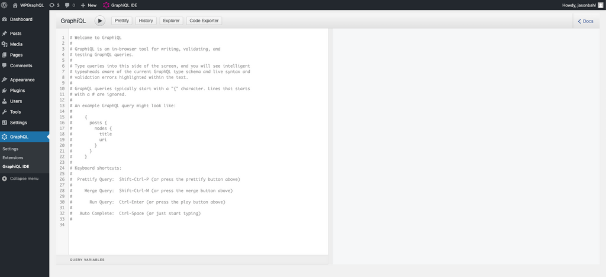
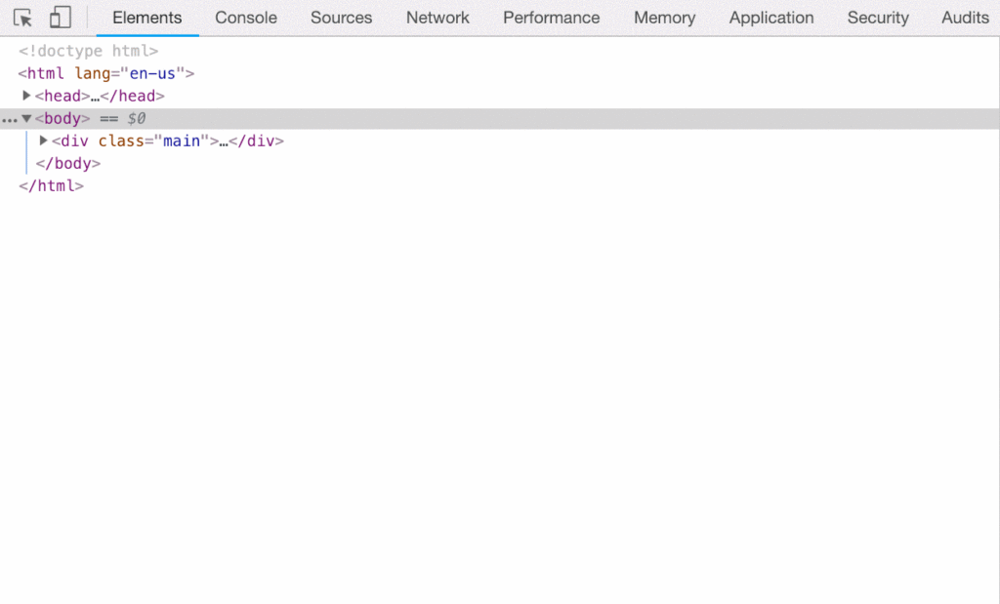

On this page, you will find details on the various ways you can interact with your WPGraphQL API.

## GraphQL IDEs and Tools

One of the most recognizable tools for interacting with GraphQL APIs is [GraphiQL](https://github.com/graphql/graphiql).

GraphiQL is a React component that acts as an IDE for interacting with GraphQL APIs. While it might be the most recognizable GraphQL IDE tool (and is maintained by the GraphQL Foundation), it's just one of many tools you can use to interact with your WPGraphQL API.

WPGraphQL ships with GraphiQL allowing you to search your GraphQL Schema and test GraphQL Queries and Mutations from your WordPress Admin.



**Below is a non-comprehensive list of helpful tools to interact with your WPGraphQL API:**

- [WPGraphiQL](https://github.com/wp-graphql/wp-graphiql) – GraphQL IDE right in your WordPress dashboard
- [GraphQL Playground](https://github.com/graphcool/graphql-playground) – GraphQL IDE that supports multi-column schema docs, tabs, query history, configuration of HTTP headers and GraphQL Subscriptions.
- [GraphiQL.app](https://github.com/skevy/graphiql-app) – A light, Electron-based wrapper around GraphiQL
- [GraphQL Network](https://github.com/Ghirro/graphql-network) – A chrome dev-tools extension for debugging GraphQL network requests.
- [GraphQL IDE](https://github.com/redound/graphql-ide) – An extensive IDE for exploring GraphQL API’s
- [Altair GraphQL Client](https://github.com/imolorhe/altair) – A beautiful feature-rich GraphQL Client for all platforms
- [Insomnia](https://insomnia.rest/) – An full-featured API client with first-party GraphQL query editor
- [Firecamp](https://firecamp.io/graphql) – GraphQL Playground with realtime team collaboration

Feel free to use any of the tools mentioned, explore and discover others that aren’t mentioned, or even build your own!

## HTTP POST Requests

WPGraphQL adds an endpoint to your WordPress site which can be queried by sending an HTTP Post request specifying at minimum a `query` as part of the request. The endpoint is either `/graphql` or `/index.php?graphql` depending on your [WordPress permalink settings](/docs/quick-start/#install).

**Components of a Request**

When making an HTTP request to a WPGraphQL server, a few things need to be included in the request:

- **Content-Type header:** The Content-Type should be set to `application/json` in the Headers of the request.
- **Method:** The method of the request should be set to `POST`
- **Body:** The body of the request should contain the following:
  - **query (required):** The string for the query (or mutation) to execute
  - **variables (optional):** JSON object of variables for use in the query
  - **operationName (optional):** The name of the operation to use for the response if multiple operations were sent in the query string

### Browser Console

One of the easiest ways to test a WPGraphQL server is to make a `fetch` request from the browser console.

You can open up Chrome Dev Tools and paste the following into your console to fetch data from WPGraphQL. (**Of course, change the URL to the API you want to fetch from.**)

```js
fetch('https://www.wpgraphql.com/graphql', {
  method: 'POST',
  headers: {
    'Content-Type': 'application/json',
  },
  body: JSON.stringify({
    query: `
        {
            generalSettings {
                url
            }
        }
    `,
  }),
})
  .then(res => res.json())
  .then(res => console.log(res.data))
```



### Curl

While Curl is not necessarily the most convenient way to query a GraphQL API, (especially more complex queries that can get quite lengthy), it's certainly possible.

Here's an example of querying a GraphQL API using CURL. You can open up tour Terminal and paste in the following:

```shell
curl \\\\
  -X POST \\\\
  -H "Content-Type: application/json" \\\\
  --data '{ "query": "{generalSettings{ url }}" }' \\\\
  https://www.wpgraphql.com/graphql
```

### WP Remote Post

Here's an example of making a request to a GraphQL API from WordPress theme or plugin code in PHP using the native WordPress `wp_remote_post` function.

```php
$request = wp_remote_post( 'https://www.wpgraphql.com/graphql', [
    'headers' => [
      'Content-Type' => 'application/json',
    ],
    'body' => wp_json_encode([
        'query' => '
            {
              generalSettings {
                url
              }
            }
        '
    ])
]);
```

If you inspected the results of the request like so:

```php
// NOTE: the `true` returns the data as an associative
// array instead of an object
$decoded_response = json_decode( $request['body'], true );
print_r( $decoded_response['data'] );
```

You should see something like the following:

```php
Array
(
    [generalSettings] => Array
        (
            [url] => https://www.wpgraphql.com
        )

)
```

## Apollo Client

When building rich JavaScript applications that rely on data from a GraphQL API, Apollo Client is one of the best options for managing the fetching and caching of GraphQL data.

Apollo client supports many of the popular JavaScript and Native frameworks such as:

- **React:** https://www.apollographql.com/docs/react/
- **Angular:** https://www.apollographql.com/docs/angular/
- **Vue:** https://github.com/akryum/vue-apollo
- **Native iOS:** https://www.apollographql.com/docs/ios
- **Native Android:** https://github.com/apollographql/apollo-android
- **Scala:** https://www.apollographql.com/docs/scalajs

## GraphQL in WordPress PHP

While HTTP POST requests are the most common way to interact with GraphQL, it's possible, and becoming more common, to interact with WPGraphQL directly from within your Theme / Plugin PHP code.

WPGraphQL exposes a `graphql()` function that allows you to execute a GraphQL query. You can use this to populate shortcodes, page templates, Gutenberg blocks, or anything else you could think of that needs data from your WordPress site to render or make decisions on in PHP.

You can use the `graphql()` method like so:

```php
$graphql = graphql([
  'query' => ' {
    generalSettings {
      url
    }
  }'
]);
```

If you inspected the results of the request like so:

```php
print_r( $graphql['data'] );
```

You should see something like the following:

```php
Array
(
    [generalSettings] => Array
        (
            [url] => https://www.wpgraphql.com
        )

)
```

## HTTP GET Requests

It's typically recommended to use HTTP POST requests with WPGraphQL, but GET requests have limited support.

For example, just paste the following url in your browser to execute an HTTP GET request on a WPGraphQL server:

```shell
https://www.wpgraphql.com/graphql?query={generalSettings{url}}
```
