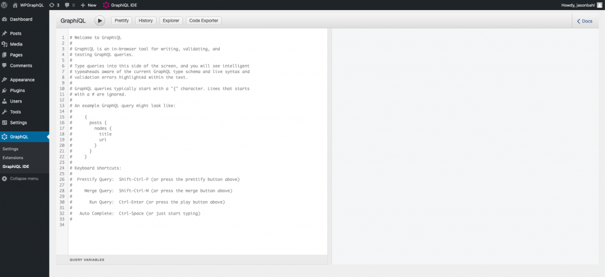
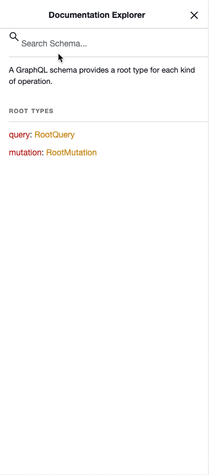
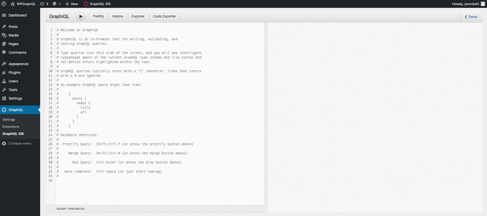

WPGraphQL is a WordPress plugin that allows developers to interact with WordPress data using [GraphQL](/docs/intro-to-graphql/).

This quick start guide is intended for developers that want to use GraphQL with WordPress. This guide will be most useful for developers already familiar with WordPress. If you're brand new to WordPress, you should check out the [Intro to WordPress](/docs/intro-to-wordpress/) guide.

## Install

WPGraphQL is a [WordPress plugin](https://www.wpbeginner.com/beginners-guide/what-are-wordpress-plugins-how-do-they-work/), so in order to use WPGraphQL with WordPress, it must first be installed and activated.

There are a few methods to install plugins to WordPress.

### Install from your WordPress Dashboard

1. Log in to your WordPress install
1. From the [Administration Panels](http://codex.wordpress.org/Administration_Panels), click on the [Plugin](http://codex.wordpress.org/Administration_Panels#Plugins) Menu
1. Under Plugins, click the “Add New” sub menu
1. Search for “WPGraphQL”
1. Click the “Install Now” button on the WPGraphQL plugin (should be the first one)
1. After installation, you will find a new menu item “GraphQL” and in the top Admin Bar will be a "GraphiQL IDE" menu item.
1. Choose your WordPress Permalink Setting. Under Settings, click Permalinks. WordPress defaults to Plain permalink structure which exposes GraphQL at /index.php?graphql. Select one of the other settings to expose GraphQL at the /graphql endpoint.

### Other Install Methods

If you prefer not to install WPGraphQL from the WordPress.org repository, you can also install from GitHub or Composer.

#### Install with Composer

Installing plugins with [Composer](https://getcomposer.org/), a PHP dependency manager, allows you to avoid committing plugin code into your project's version control.

WPGraphQL is available for installing with Composer from [packagist.org](https://packagist.org/packages/wp-graphql/wp-graphql) and [wpackagist.org](https://wpackagist.org/search?q=wp-graphql&amp;type=any&amp;search=).

The most straight forward way to install WPGraphQL with composer would be to run the following command:

```shell
composer require wp-graphql/wp-graphql
```

This would add WPGraphQL as a dependency for your project.

The fine folks of [roots.io](https://roots.io/) have written more information on [Using Composer with WordPress](https://roots.io/using-composer-with-wordpress/).

#### Download Zip from Github

Starting with the [v1.2.5 release](https://github.com/wp-graphql/wp-graphql/releases/tag/v1.2.5), a zip of the compiled plugin is added as a release asset to each release.

To download, navigate to the Releases page, and find the release you would like to install.

Under the "assets" section of the release will be a `wp-graphql.zip` file that you can download and install from your WordPress dashboard, or by adding the unzipped plugin to your WordPress `wp-content/plugins` directory.

#### Clone from Github

This install method is recommended for contributors that would like to submit pull requests to the codebase. This step assumes you have Composer [installed](https://getcomposer.org/doc/00-intro.md) locally, `git` [installed](https://git-scm.com/book/en/v2/Getting-Started-Installing-Git) locally and [SSH keys setup with Github](https://docs.github.com/en/github/authenticating-to-github/generating-a-new-ssh-key-and-adding-it-to-the-ssh-agent).

1. In your command line, navigate to your WordPress plugin directory (`wp-content/plugins`)
1. Run the following command `git clone git@github.com:wp-graphql/wp-graphql.git`
1. This will install WPGraphQL to your plugins directory under `/wp-content/plugins/wp-graphql`
1. Run the following command to install vendor dependencies: `composer install`. (You can also run `composer install --no-dev` to not install the dev dependencies needed for testing and linting).
1. From the [Administration Panels](http://codex.wordpress.org/Administration_Panels), click on the [Plugin](http://codex.wordpress.org/Administration_Panels#Plugins) Menu
1. WPGraphQL should now show up as a plugin. 
1. Click "Activate"

## Use GraphiQL and Write your first GraphQL Query

Once WPGraphQL is installed and activated, it's time to write your first [GraphQL Query](/docs/intro-to-graphql/).

WPGraphQL includes a helpful tool called Graph*i*QL [IDE](https://www.redhat.com/en/topics/middleware/what-is-ide#:~:text=An%20integrated%20development%20environment%20%28IDE,graphical%20user%20interface%20%28GUI%29.), a tool that allows you to explore your GraphQL Schema end execute GraphQL Queries and Mutations.

### Open GraphiQL

Open the Graph*i*QL IDE by clicking the "GraphiQL IDE" button in your WordPress Admin Bar.


This will take you to the GraphiQL IDE page.



### Search the Schema

Click the "Docs" button at the top right of the Graph*i*QL IDE.

This will expand a "Documentation Explorer" that can be used to see what Types and Fields are available in the WPGraphQL Schema.

Let's search the Schema for something WordPress is known for: "Posts"<br><br>In the "Search Schema" field, enter the word "posts". You should see results similar to the below screen recording.



### Write Your First WPGraphQL Query

In the left pane, select the grayed out text and delete it.

Then paste in the following:

```graphql
query {
  posts {
    nodes {
      id
      title
    }
  }
}
```

Then click the "Play" button to execute the query.

Your Query will be sent to your site's WPGraphQL API endpoint and will return results that match the data that you asked for.



## Next Steps

Now that you have WPGraphQL installed and activated and have written your first query, consider some of the following guides to get more familiar with using GraphQL with WordPress:

- [Intro to GraphQL](/docs/intro-to-graphql/)
- [Intro to WordPress](/docs/intro-to-wordpress/)
- [Build your first WPGraphQL Extension](http://build)
